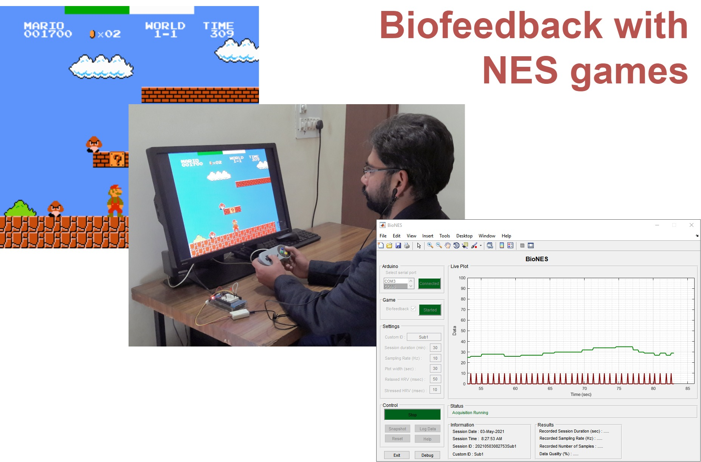

# Introduction {#intro}

---

## About the project {#about}

```{r fig.cap= 'Block diagram of BioNES', echo=FALSE, fig.align='center', out.width='75%'}

```

BioNES (Biofeedback Nintendo Entertainment System) is an open-source plug-and-play MATLAB-based tool to use NES games for multimodal biofeedback. It can be used to deliver the HRV biofeedback via any game designed for the NES system. It can receive real-time heartbeat interval (RR) values from Arduino + ear-clip PPG sensor (or any sensor capable to send real-time heart rate pulses to Arduino). After the acquisition, it computes real-time heart rate and heart rate variability (HRV), biofeedback parameters and then sends feedback to the FCEUX emulator which is used to play the NES game.
Besides in-game biofeedback, it also offers real-time data visualization in time-series plots and local saving of data for offline analysis. This tool can benefit the researchers (especially from biofeedback or physiological measurement domain) or hobbyist, who want to quickly deploy a biofeedback system, want to explore the NES games for biofeedback, or just want to record the physiological signals.


## Built with

- GUI is built using the `Guide` tool in [MATLAB-v2017b](https://in.mathworks.com/products/matlab.html). 
- [Arduino](https://www.arduino.cc/) Mega board for hardware.
- [Grove ear-clip sensor](https://wiki.seeedstudio.com/Grove-Ear-clip_Heart_Rate_Sensor/) for photoplethysmograph (PPG) data acquisition.
- [FCEUX](https://github.com/TASVideos/fceux) emulator to play NES game.
- [Super Mario Bros.](https://www.mariowiki.com/Super_Mario_Bros.) game for feedback.


## Features

- Plug and play biofeedback system for SMB game (using other NES games may need minor changes).
- Data acquisition sampling rate of 10 Hz to acquire RR intervals from Arduino. 
- Feedback is displayed at a fixed refresh rate at 60 Hz.
- Real-time data visualization (in time-series plot).
- Local saving of data in `.mat` format for offline analysis.
- Screenshot of current GUI for reference purpose.
- 3 independent modes of working.
  - Data acquisition only
  - Gameplay without biofeedback
  - Gameplay with biofeedback


## Why this tool?

Biofeedback therapy has potential benefits for managing stress. However, traditional biofeedback is an expensive and monotonous process. To increase the engagement in biofeedback sessions, video games can be used. But the problem is the limited availability of affordable video-game-based biofeedback solutions.
BioNES is developed keeping in mind the cost-effectiveness and ease of use to deliver biofeedback while simultaneously providing reliability as a research tool and flexibility to allow researchers/developers to modify as per their needs. The efficacy of BioNES is validated using observational study and the paper is currently under review in a reputed journal.

