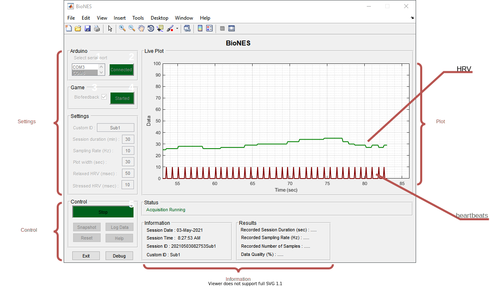
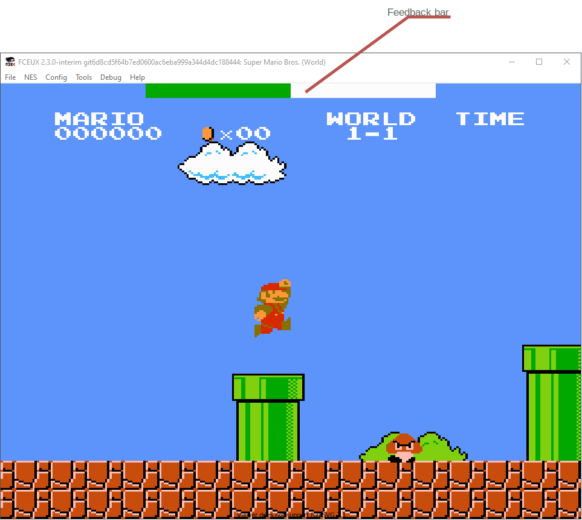

# Getting Started {#getting-started}

---


## Prerequisites

- [MATLAB](https://in.mathworks.com/products/matlab.html)  

>`MATLAB-ver2017b` was used to develop the BioNES. It was also tested with `ver2015b` and `ver2018b` for backward and forward compatibility respectively.  

- [Arduino](https://www.arduino.cc/) hardware board.   
- [Grove ear-clip sensor](https://wiki.seeedstudio.com/Grove-Ear-clip_Heart_Rate_Sensor/).
- [FCEUX](https://github.com/TASVideos/fceux).
- NES game ROM file. This version of BioNES uses the Super Mario Bros. game without any modification, for other NES games you have to make minor changes to the `BioNES.lua` file.  


## Installation and Running

1. Download the [latest stable release](https://github.com/kulbhushanchand/BioNES/releases) and extract contents into your MATLAB working directory. Alternatively, you can also download the latest code from the [repository](https://github.com/kulbhushanchand/BioNES).
2. Open `BioNES.m` in MATLAB.
3. Connect Arduino board to PC with USB cable. Upload `BioNES.ino` sketch to Arduino board.
4. Connect the ear-clip sensor to the Arduino board.
4. Run `BioNES.m` and wait for the GUI to appear.
5. In the GUI select the `COM` port for the Arduino and press the `Connect` button. 
6. After a successful connection, appropriate settings can be selected.
7. Select the biofeedback checkbook (if biofeedback gameplay is needed) and press the `Connect` button in the `Game` panel. The `FCEUX` window will open with the pre-configured settings. 
8. Start the acquisition from the `Start/Stop` button in the `Control` panel.
9. The acquisition runs till a set time or can be stopped manually.
10. After successful completion, the information panel shows various statistics related to the acquisition.
11. Finally, the data can be saved for offline processing.


## GUI 

```{r gui, fig.cap= 'GUI of BioNES. Various sub-components (Settings, Plot, Information, and Control) are labelled. Minimum interaction steps to use are numbered 1 to 4.', fig.align='center', echo=FALSE, out.width = '100%'}

```

```{r game, fig.cap= 'Biofeedback enables NES game in FCEUX emulator. Feedback bar is shown on the top', fig.align='center', echo=FALSE, out.width = '75%'}

```

The user interface (Figure \@ref(fig:gui)) is straightforward and easy to use. The various sub-components are arranged in panels as per their functionality. The main sub-components of the GUI and their functions are described below:

- Settings
  - `Arduino`: Lists the available `COM` ports. Establishes a connection to the Arduino.
  - `Game`: List the option to enable biofeedback and start the game.
  - `Settings`: Lists various settings with defaults.
- Information
  - `Status`: Panel showing the current status of the GUI.
  - `Daq Information`: Panel for important information regarding the current session.
  - `Results`: Panel to display the results after the successful acquisition.
- Plot
  - `Live plot`: Panel displaying a real-time plot of the acquired data. 
- Control
  - `Control`: Panel to control the state of the GUI and data logging.

Figure \@ref(fig:gui) shows the minimum number of steps (labeled from 1 to 4) required for a simple biofeedback session. However, the number of steps may increase depending upon the user's preference. Following is a brief explanation for each of these steps.

1. Select the `COM` port from the list to which the Arduino board is connected.
2. Connect to the board.
3. Select the checkbox to enable biofeedback.
4. Start the game.
5. Start the acquisition and play the game. You can pre-maturely stop the acquisition using the `Start/Stop` button at will or let it finish by itself till the session duration. 

