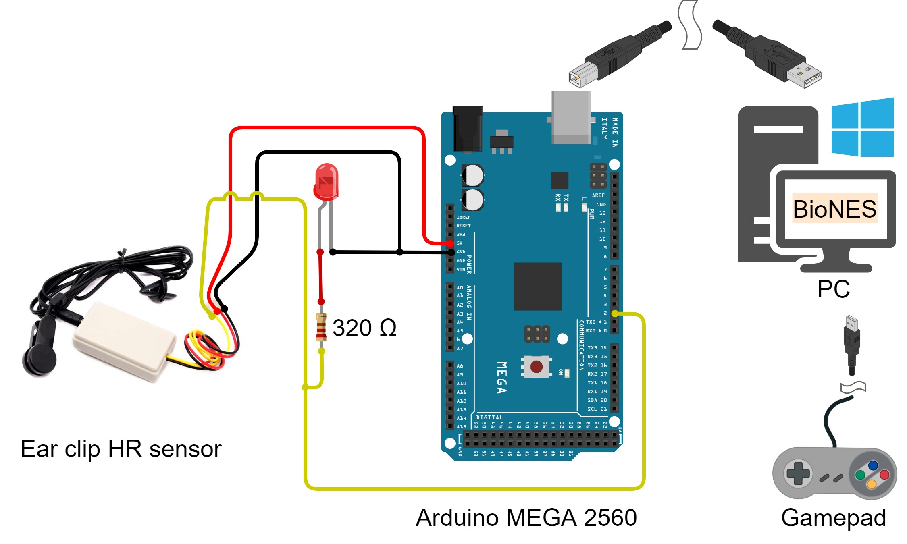
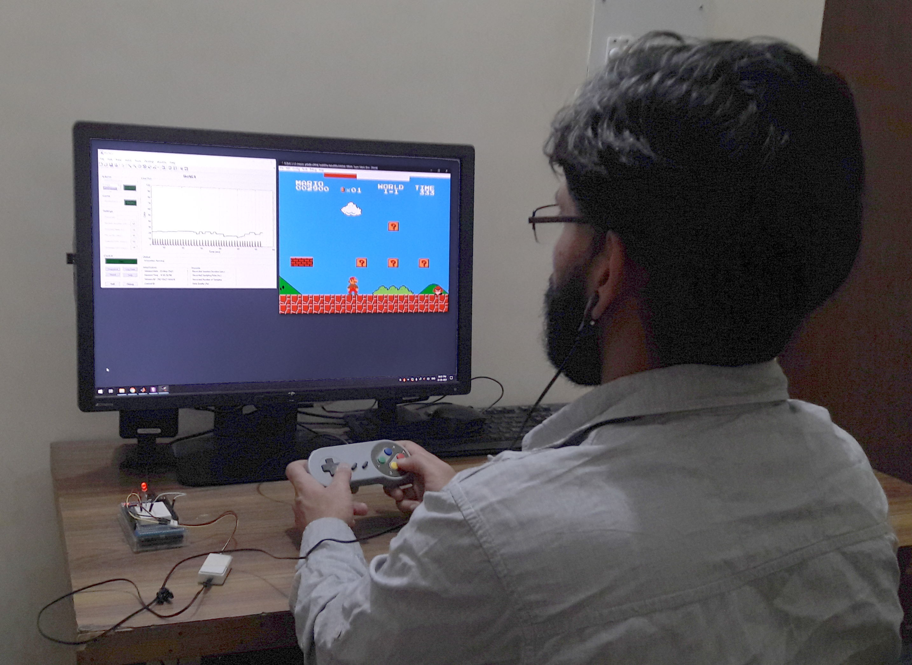

# Usage {#usage}


BioNES can be used in three different modalities -

- Physiological data acquisition only
- Non-biofeedback gameplay
- Biofeedback enabled gameplay

In the section below, a simple example to use the BioNES in the "Biofeedback enabled gameplay" mode is shown.

**Hardware Setup**

Arduino Mega with an Ear-clip HR sensor is used to acquire real-time RR intervals.

```{r fig.cap= 'Hardware Setup', echo=FALSE, fig.align='center', out.width='75%'}

```


**Gameplay**

Steps detailed in section \@ref(installation-and-running) can be followed 

```{r fig.cap= 'Gameplay', echo=FALSE, fig.align='center', out.width='75%'}

```